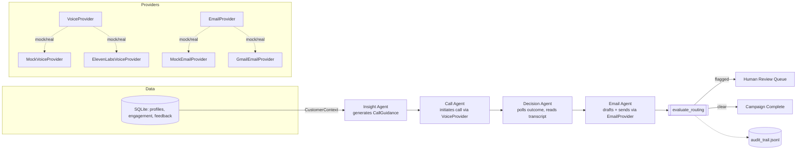
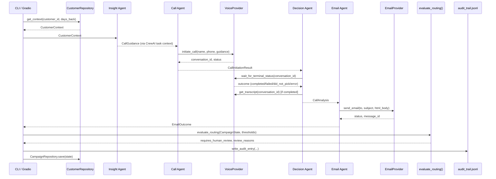
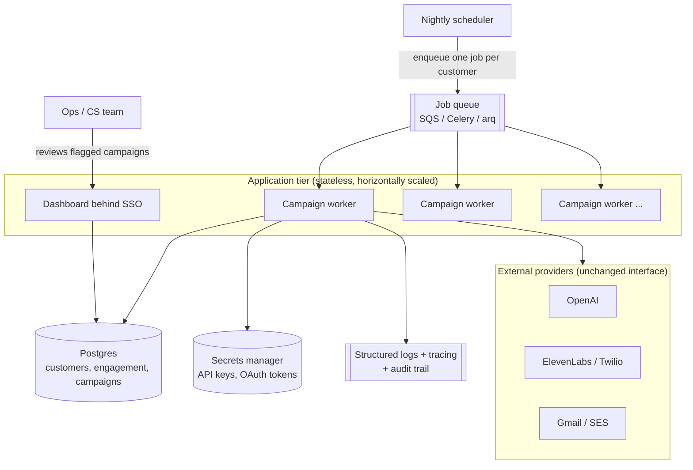

# OutreachIQ

A multi-agent AI system for personalized customer outreach.
It looks at what a customer has actually done — courses watched, feedback
left, time since last activity — turns that into call guidance, places a
voice call, reads the outcome, and writes a follow-up email that matches
what really happened on the call. Every step is a typed [CrewAI](https://www.crewai.com/)
agent with a Pydantic-validated output, and every campaign is logged to an
append-only audit trail.

The point of this project is the architecture, not the phone bill: voice and
email delivery run through a **pluggable provider interface**. By default
both are mock providers, so the entire pipeline — insight generation, a
simulated call with a realistic outcome distribution, outcome analysis, and
a follow-up email written to disk — runs end-to-end with nothing but an
OpenAI key. Real backends (ElevenLabs + Twilio for calling, Gmail for email)
are swapped in behind the exact same interface with one config flag.

See [CASE_STUDY.md](CASE_STUDY.md) for how this architecture would actually
get taken from this demo to a live client engagement — discovery, pilot,
guardrail sign-off, phased rollout, and ongoing monitoring — using a retail
scenario mapped step-by-step onto the code in this repo.

## Why this design

| Decision | Reasoning |
|---|---|
| Typed I/O everywhere (`AgentOutput` base with `confidence`, `evidence`, `reasoning_summary`, `warnings`) | Every agent's output is auditable and machine-checkable, not a blob of prose the next agent has to re-parse. |
| `VoiceProvider` / `EmailProvider` abstract interfaces | Decouples the agent logic from any one vendor. Anyone can clone this repo and run the full demo without ElevenLabs, Twilio, or Google credentials. |
| Pure-function routing (`routing.py`) | The human-in-the-loop decision (low confidence, missing phone number, failed send, error outcome) is a plain function with no I/O — fully unit-tested without mocking an LLM. |
| `output_pydantic` on every CrewAI `Task` | CrewAI validates the LLM's structured output against the Pydantic schema itself; no manual JSON parsing, no shared mutable state passed between tools. |
| SQLAlchemy 2.0 typed models + repository pattern | Customer data access and campaign persistence are isolated behind `CustomerRepository` / `CampaignRepository`, independent of any specific database. |

## Architecture



### A single campaign run, step by step



## System design and trade-offs

**Sequential, not parallel, orchestration.** The four agents run in CrewAI's
`Process.sequential`, not hierarchical or concurrent. This isn't a framework
default I left in place — it's forced by the data dependency: you cannot
write a truthful follow-up email before you know how the call actually went,
and you cannot know that before the call has a terminal status. The cost is
latency (each customer's campaign is a strict chain), but running multiple
*customers'* campaigns concurrently is still possible — that would mean one
`Crew` per customer, which the current `run_campaign()` boundary already
supports; it just isn't wired up to a job queue yet (see Limitations).

**Typed task outputs instead of shared mutable state.** An earlier version of
this idea (and a common pattern in CrewAI tutorials) threads a single mutable
dict through every tool call so each tool can read/write shared fields. That
works but makes testing and reasoning about ordering harder, and it doesn't
survive a process restart. Here, every `Task` declares `output_pydantic`, so
CrewAI validates the LLM's structured output against a schema, and
`workflow.py` assembles the final `CampaignState` by reading
`task.output.pydantic` once at the end — no shared state object, no global
mutation, and every intermediate result is independently serializable and
testable.

**Mock providers as the default, not an afterthought.** The trade-off here is
explicit: mock behavior can drift from real vendor quirks (ElevenLabs'
specific status strings, Twilio error codes, Gmail quota errors), so passing
tests against the mock does not guarantee the real integration behaves
identically — a manual smoke test against a real backend is still warranted
before trusting it. What it buys in return: anyone can clone this repo and
run the full four-agent pipeline, see a realistic distribution of call
outcomes, and inspect a sent email, without ElevenLabs, Twilio, or Google
credentials. Given this is a portfolio artifact meant to be read and run, not
a paid service, that trade-off is the right one here.

**SQLite, not Postgres.** Zero setup, and SQLAlchemy's Core/ORM layer means
swapping `DATABASE_URL` to Postgres requires no code changes in
`db/repository.py`. The trade-off: SQLite's single-writer model means
concurrent campaign runs from multiple processes will serialize on writes,
which is a real limitation for anything beyond a demo or single-user tool.

**Human review is a terminal flag, not a resumable checkpoint.** When
`evaluate_routing()` flags a campaign, the run still completes and is
persisted with `requires_human_review=True` for a person to act on
afterward — it does not pause mid-pipeline and wait for approval before, say,
sending the email. A true interrupt-and-resume flow (stop before the risky
step, wait for a human decision, then continue) is what a graph-based
orchestrator like LangGraph is built for; CrewAI's sequential `Process`
doesn't give you that checkpoint/resume primitive for free, and building it
by hand was out of scope for what this project is demonstrating. Flagging a
completed run for review — closer to how a real support/ops queue works — is
a deliberate, honest scope cut, not an oversight.

**Confidence is self-reported by the LLM, not calibrated.** Each agent is
asked to state its own confidence, and `evaluate_routing()` treats that
number as ground truth. It is not validated against a held-out set of known
outcomes. That's a reasonable placeholder for a portfolio pipeline; a
production system would want a calibration step (comparing stated confidence
against actual downstream outcomes over time) or an independent verifier
model rather than trusting self-reported scores at face value.

## Limitations and possible extensions

- **One customer per run.** `main.py` takes a single `--customer-id`; there's
  no batch/nightly-campaign runner. Extending to a customer list would mean
  wrapping `run_campaign()` in a queue (Celery/RQ/arq) and running many
  `Crew` instances concurrently.
- **No retry/backoff on provider calls.** A transient failure in a real
  ElevenLabs or Gmail call today just becomes a recorded error and a
  human-review flag; a production version would retry transient failures
  before giving up.
- **No auth on the Gradio dashboard.** It's a local demo tool, not something
  to expose publicly as-is.
- **Secrets in `.env`.** Fine for local development; a real deployment would
  use a secrets manager (AWS Secrets Manager, Vault, etc.) instead of a
  dotenv file.
- **Guardrails are keyword/pattern checks, not a content classifier.** They
  catch the specific failure modes this pipeline can produce (an unfilled
  template placeholder, an unauthorized offer, a claim about a call that
  didn't happen) — see [Guardrails](#guardrails) below. A system generating
  more open-ended content would want an LLM-based or fine-tuned classifier
  in addition to fixed patterns, not instead of them.
- **Tracing has no backend wired up by default.** Spans print to the console
  out of the box (see [Observability](#observability)) — that's real
  OpenTelemetry instrumentation, but nothing is aggregated, alerted on, or
  queryable across runs until `OTEL_EXPORTER_OTLP_ENDPOINT` points at an
  actual collector.

## Target production architecture

What's implemented today is a single-process demo by design (see
Limitations above). The diagram below is the architecture I'd stand up to
run this for real, and every box maps to a boundary that already exists in
the code — this is a matter of adding infrastructure around existing
interfaces, not rewriting the pipeline.



Getting from the current demo to this is additive, not a rewrite:

1. **`DATABASE_URL` → Postgres.** No code change — `db/repository.py` and
   `db/schema.py` already go through SQLAlchemy Core, not raw SQLite calls.
2. **Wrap `run_campaign()` in a queue consumer.** The function is already a
   clean, single-argument unit of work (`customer_id`); a worker just needs
   to pull a job and call it. This is what turns "one customer per CLI
   invocation" into "process the whole customer list nightly."
3. **Put the Gradio dashboard behind SSO / a reverse proxy with auth** rather
   than exposing it directly — it currently has none, by design, since it's
   a local demo tool.
4. **Move secrets from `.env` to a secrets manager** (AWS Secrets Manager,
   Vault) and inject them as environment variables at deploy time — the
   `Settings` class in `config.py` doesn't care where the values come from.
5. **Point tracing at a real collector.** The OpenTelemetry instrumentation
   already exists (campaign, crew, and every provider call are real spans —
   see [Observability](#observability)); this step is setting
   `OTEL_EXPORTER_OTLP_ENDPOINT` and standing up the collector, not writing
   new instrumentation.

## Data governance and compliance

This pipeline touches real personal data by nature — names, emails, phone
numbers, and call transcripts, which can contain anything a customer says.
That has consequences beyond code quality:

- **Consent and opt-out.** Nothing in this project checks a do-not-call or
  do-not-email list, or verifies the customer previously agreed to be
  contacted this way. Any real deployment placing outbound calls needs that
  check *before* the Call Agent runs — in the US this is a hard requirement
  under TCPA, not an optional nicety.
- **Right to erasure (GDPR/CCPA).** `CustomerRepository` and
  `CampaignRepository` key everything off `customer_id`, so a delete-by-id
  routine (purge profile, engagement, feedback, campaign records, and
  matching audit entries) is straightforward to add — it just isn't wired
  up to anything yet.
- **Retention.** `logs/audit_trail.jsonl` and the campaign table currently
  grow forever, including transcript text. A real deployment needs an
  explicit retention window and a scheduled purge, not indefinite storage
  of call content.
- **Encryption.** API calls to OpenAI/ElevenLabs/Gmail are already
  HTTPS-in-transit. At rest, SQLite has no built-in encryption — moving to
  Postgres with disk-level encryption (the default on any managed cloud DB)
  closes that gap as part of the same migration already described above.
- **What's already in place:** the append-only audit trail
  (`audit.py`) means every automated decision — including *why* a campaign
  was or wasn't flagged for human review — is independently reconstructable,
  which is exactly the kind of traceability compliance reviews ask for. That
  part doesn't need to be bolted on later.

## Cost model

Mock providers make local development and CI free. Real usage has three
independent cost drivers, and the point of listing them separately is that
each one is controlled differently — plug in current vendor pricing rather
than trusting any number here to stay accurate:

| Driver | What drives it | Where it's controlled |
|---|---|---|
| LLM tokens (OpenAI) | 4 agent calls per campaign; prompt size scales with `days_back` (more engagement/feedback rows → longer prompts) | `thresholds.days_back_default`, and swapping `openai_model` for a cheaper tier |
| Voice minutes (ElevenLabs/Twilio) | Only incurred for `completed` and `did_not_pick` outcomes reaching the provider — `failed`/`skipped` calls never connect | `thresholds.max_call_wait_seconds` bounds worst-case call length |
| Email (Gmail/SES) | Effectively free at this volume — Gmail API has a generous free daily quota | N/A until sending at real marketing volume |

The one architectural lever that matters most for cost at scale:
`VOICE_PROVIDER=mock` and `EMAIL_PROVIDER=mock` cost nothing, so every test,
every CI run, and every local development loop is free — only a deliberately
configured production deployment ever touches a paid API.

## Project layout

```
outreach-iq/
├── Dockerfile                     # multi-stage build for the CLI/dashboard
├── main.py                       # CLI entry point
├── config/settings.yaml          # non-secret thresholds (confidence floor, timeouts, ...)
├── src/outreachiq/
│   ├── config.py                 # pydantic-settings: .env + settings.yaml
│   ├── models.py                 # every typed contract between agents
│   ├── routing.py                # pure human-review routing logic
│   ├── audit.py                  # append-only JSONL audit trail
│   ├── guardrails.py             # content-safety checks on outgoing email
│   ├── observability.py          # OpenTelemetry tracer setup
│   ├── db/                       # SQLAlchemy schema, session, repositories
│   ├── providers/                # VoiceProvider / EmailProvider + mock & real backends
│   ├── agents/                   # the four CrewAI agents + their tasks/tools/prompts
│   ├── workflow.py                # builds the Crew, maps task outputs -> CampaignState
│   └── campaign.py               # run_campaign(): orchestrate + route + audit + persist
├── ui/app.py                     # single-page Gradio dashboard
├── scripts/
│   ├── generate_seed_data.py     # deterministic synthetic sample data generator
│   └── seed_db.py                # loads data/seed/*.csv into the database
├── data/seed/                    # committed synthetic sample data (no real customer data)
└── tests/                        # routing, providers, repository, models, config
```

## The four agents

1. **Insight Agent** — reads a customer's recent engagement and feedback, produces `CallGuidance` (goal, key talking points, one open question, next step). Low signal in the data → low confidence, honestly, not invented detail.
2. **Call Agent** — places one outbound call through the configured `VoiceProvider`, or reports `skipped` if there's no phone number on file.
3. **Decision Agent** — polls the call to a terminal outcome (`completed` / `failed` / `did_not_pick` / `error`), pulls the transcript when applicable, and produces `CallAnalysis` with guidance for the email agent.
4. **Email Agent** — drafts and sends a follow-up that matches exactly what happened, never a generic template regardless of outcome.

After all four run, `evaluate_routing()` flags the campaign for human review if: any agent's confidence is below the configured floor, the customer had no phone number, the call errored out, the email failed to send or was blocked by a guardrail, the email contradicts what the call actually did, or any stage recorded an error.

## Guardrails

An LLM agent with a tool that sends real email to real customers is exactly
where a "just prompt it correctly" approach breaks down — the Email Agent's
prompt already says "never reference a conversation that didn't happen," but
a prompt is a request, not a control. `guardrails.py` backs that request
with two checks that run regardless of what the LLM decides to do:

- **Preventive — `check_outgoing_email_content`.** Runs *inside*
  `send_email_tool`, before any provider (mock or real) is called. Blocks
  the send outright (`status="blocked"`, nothing goes out) if the body is
  suspiciously short or empty, the subject is missing, a template
  placeholder like `{{customer_name}}` was left unfilled, or the text
  contains an offer no one authorized (a refund, a discount code, "free
  trial") — the kind of thing an LLM can produce if a customer's own
  feedback text ends up read into its prompt and it treats that text as an
  instruction rather than data.
- **Detective — `check_email_matches_call_outcome`.** Runs afterward, in
  `evaluate_routing()`, once both the sent email and the call analysis
  exist. Flags (doesn't block — the email is already sent by this point) a
  campaign where the email references "our call" or "our conversation" but
  the call outcome wasn't `completed`.

Both are plain functions over typed models — no LLM, no network — so every
case in `tests/test_guardrails.py` is a direct input/output assertion, the
same style as `routing.py`'s tests. They're intentionally narrow: fixed
keyword/pattern checks that catch the specific failure modes *this*
pipeline can produce, not a general-purpose content moderation system (see
Limitations).

## Observability

Every campaign, the crew's execution, and every call to a
`VoiceProvider`/`EmailProvider` is a real [OpenTelemetry](https://opentelemetry.io/)
span — `outreachiq.campaign` → `crew.kickoff` → `voice.initiate_call` /
`voice.wait_for_terminal_status` / `voice.get_transcript` / `email.send`,
with attributes (customer id, conversation id, outcome, status) and
exceptions recorded on the span, not just logged as text. Per-stage
completion is marked with span events (`insight.completed`,
`call.completed`, ...) via each CrewAI `Task`'s `callback`, so a single
trace shows where time was actually spent across the four agents.

By default spans print to the console (`ConsoleSpanExporter`) — zero
external infrastructure, so this is inspectable the moment you run
`main.py`. Setting `OTEL_EXPORTER_OTLP_ENDPOINT` switches to shipping spans
to a real collector (Jaeger, Tempo, Honeycomb, ...) with no code changes:

```bash
uv sync --extra otel-otlp
OTEL_EXPORTER_OTLP_ENDPOINT=http://localhost:4318/v1/traces uv run python main.py --customer-id C100
```

This is deliberately kept separate from the audit trail in `audit.py`: the
audit log answers *what decision was made and why* (for a human reviewing a
campaign), tracing answers *how long each step took and where it failed*
(for debugging the system itself). They're different audiences and neither
one substitutes for the other.

## Running it

Requires Python 3.11+. [`uv`](https://docs.astral.sh/uv/) is the primary workflow; plain `venv` + `pip` works identically.

```bash
# with uv
uv sync --extra dev
cp .env.example .env        # then add your OPENAI_API_KEY
uv run python scripts/seed_db.py
uv run python main.py --customer-id C100
uv run python ui/app.py     # Gradio dashboard at http://localhost:7860
uv run pytest

# with plain venv + pip
python -m venv .venv && source .venv/Scripts/activate   # Windows: .venv\Scripts\activate
pip install -e ".[dev]"
cp .env.example .env
python scripts/seed_db.py
python main.py --customer-id C100
python ui/app.py
pytest
```

Nothing above needs ElevenLabs, Twilio, or Google credentials — `VOICE_PROVIDER` and
`EMAIL_PROVIDER` default to `mock`. Simulated calls resolve instantly (no real polling
delay) and follow-up emails are written as `.html` files to `./outbox`.

### Running with Docker

```bash
docker build -t outreachiq .

# seed the database into a named volume, then run a campaign
docker run --rm -v outreachiq_data:/app/data outreachiq python scripts/seed_db.py
docker run --rm --env-file .env -v outreachiq_data:/app/data outreachiq python main.py --customer-id C100

# dashboard, exposed on localhost:7860
docker run --rm -p 7860:7860 --env-file .env -v outreachiq_data:/app/data outreachiq
```

### Switching to real providers

```bash
# .env
VOICE_PROVIDER=elevenlabs
ELEVENLABS_API_KEY=...
ELEVENLABS_AGENT_ID=...
ELEVENLABS_PHONE_NUMBER_ID=...

EMAIL_PROVIDER=gmail
GOOGLE_CREDENTIALS_FILE=credentials.json   # OAuth client secret from Google Cloud Console
SENDER_EMAIL=you@yourdomain.com
```

```bash
uv sync --extra elevenlabs --extra gmail
```

No agent, tool, or workflow code changes — the interfaces in `providers/base.py` are
identical either way.

## Data

`data/seed/*.csv` is entirely synthetic, generated by `scripts/generate_seed_data.py`
with a fixed random seed (no real customer data was used or is included anywhere in
this repository).

## License

MIT — see [LICENSE](LICENSE).
