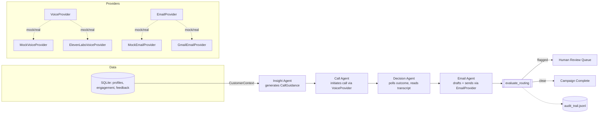

# OutreachIQ

A multi-agent AI system for personalized customer outreach.
It looks at what a customer has actually done — courses watched, feedback
left, time since last activity — turns that into call guidance, places a
voice call, reads the outcome, and writes a follow-up email that matches
what really happened on the call. Every step is a typed [CrewAI](https://www.crewai.com/)
agent with a Pydantic-validated output, and every campaign is logged to an
append-only audit trail.

The point of this project is the architecture, not the phone bill: voice and
email delivery run through a **pluggable provider interface**. By default
both are mock providers, so the entire pipeline — insight generation, a
simulated call with a realistic outcome distribution, outcome analysis, and
a follow-up email written to disk — runs end-to-end with nothing but an
OpenAI key. Real backends (ElevenLabs + Twilio for calling, Gmail for email)
are swapped in behind the exact same interface with one config flag.

## Why this design

| Decision | Reasoning |
|---|---|
| Typed I/O everywhere (`AgentOutput` base with `confidence`, `evidence`, `reasoning_summary`, `warnings`) | Every agent's output is auditable and machine-checkable, not a blob of prose the next agent has to re-parse. |
| `VoiceProvider` / `EmailProvider` abstract interfaces | Decouples the agent logic from any one vendor. Anyone can clone this repo and run the full demo without ElevenLabs, Twilio, or Google credentials. |
| Pure-function routing (`routing.py`) | The human-in-the-loop decision (low confidence, missing phone number, failed send, error outcome) is a plain function with no I/O — fully unit-tested without mocking an LLM. |
| `output_pydantic` on every CrewAI `Task` | CrewAI validates the LLM's structured output against the Pydantic schema itself; no manual JSON parsing, no shared mutable state passed between tools. |
| SQLAlchemy 2.0 typed models + repository pattern | Customer data access and campaign persistence are isolated behind `CustomerRepository` / `CampaignRepository`, independent of any specific database. |

## Architecture



## Project layout

```
outreach-iq/
├── main.py                       # CLI entry point
├── config/settings.yaml          # non-secret thresholds (confidence floor, timeouts, ...)
├── src/outreachiq/
│   ├── config.py                 # pydantic-settings: .env + settings.yaml
│   ├── models.py                 # every typed contract between agents
│   ├── routing.py                # pure human-review routing logic
│   ├── audit.py                  # append-only JSONL audit trail
│   ├── db/                       # SQLAlchemy schema, session, repositories
│   ├── providers/                # VoiceProvider / EmailProvider + mock & real backends
│   ├── agents/                   # the four CrewAI agents + their tasks/tools/prompts
│   ├── workflow.py                # builds the Crew, maps task outputs -> CampaignState
│   └── campaign.py               # run_campaign(): orchestrate + route + audit + persist
├── ui/app.py                     # single-page Gradio dashboard
├── scripts/
│   ├── generate_seed_data.py     # deterministic synthetic sample data generator
│   └── seed_db.py                # loads data/seed/*.csv into the database
├── data/seed/                    # committed synthetic sample data (no real customer data)
└── tests/                        # routing, providers, repository, models, config
```

## The four agents

1. **Insight Agent** — reads a customer's recent engagement and feedback, produces `CallGuidance` (goal, key talking points, one open question, next step). Low signal in the data → low confidence, honestly, not invented detail.
2. **Call Agent** — places one outbound call through the configured `VoiceProvider`, or reports `skipped` if there's no phone number on file.
3. **Decision Agent** — polls the call to a terminal outcome (`completed` / `failed` / `did_not_pick` / `error`), pulls the transcript when applicable, and produces `CallAnalysis` with guidance for the email agent.
4. **Email Agent** — drafts and sends a follow-up that matches exactly what happened, never a generic template regardless of outcome.

After all four run, `evaluate_routing()` flags the campaign for human review if: any agent's confidence is below the configured floor, the customer had no phone number, the call errored out, the email failed to send, or any stage recorded an error.

## Running it

Requires Python 3.11+. [`uv`](https://docs.astral.sh/uv/) is the primary workflow; plain `venv` + `pip` works identically.

```bash
# with uv
uv sync --extra dev
cp .env.example .env        # then add your OPENAI_API_KEY
uv run python scripts/seed_db.py
uv run python main.py --customer-id C100
uv run python ui/app.py     # Gradio dashboard at http://localhost:7860
uv run pytest

# with plain venv + pip
python -m venv .venv && source .venv/Scripts/activate   # Windows: .venv\Scripts\activate
pip install -e ".[dev]"
cp .env.example .env
python scripts/seed_db.py
python main.py --customer-id C100
python ui/app.py
pytest
```

Nothing above needs ElevenLabs, Twilio, or Google credentials — `VOICE_PROVIDER` and
`EMAIL_PROVIDER` default to `mock`. Simulated calls resolve instantly (no real polling
delay) and follow-up emails are written as `.html` files to `./outbox`.

### Switching to real providers

```bash
# .env
VOICE_PROVIDER=elevenlabs
ELEVENLABS_API_KEY=...
ELEVENLABS_AGENT_ID=...
ELEVENLABS_PHONE_NUMBER_ID=...

EMAIL_PROVIDER=gmail
GOOGLE_CREDENTIALS_FILE=credentials.json   # OAuth client secret from Google Cloud Console
SENDER_EMAIL=you@yourdomain.com
```

```bash
uv sync --extra elevenlabs --extra gmail
```

No agent, tool, or workflow code changes — the interfaces in `providers/base.py` are
identical either way.

## Data

`data/seed/*.csv` is entirely synthetic, generated by `scripts/generate_seed_data.py`
with a fixed random seed (no real customer data was used or is included anywhere in
this repository).

## License

MIT — see [LICENSE](LICENSE).
